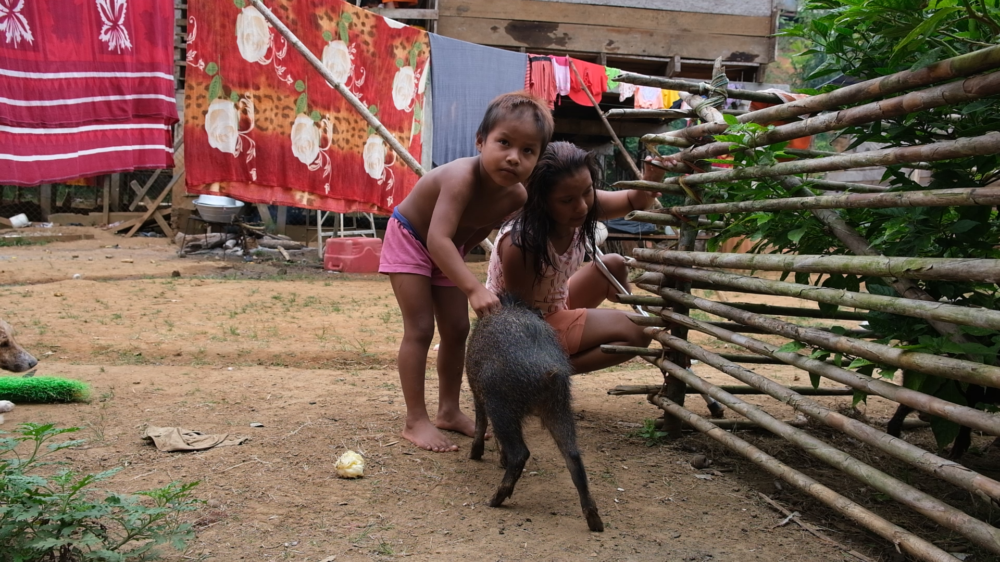

Evening in <a href="https://www.openstreetmap.org/#map=17/8.275241/-77.523876">Nazareth</a>.

Embera woman preparing Achiote, a condiment the Emberas use in many of their meals.

Kids in <a href="https://www.openstreetmap.org/#map=17/8.221854/-77.553724">Villa Nueva</a> petting a <a href="https://en.wikipedia.org/wiki/Collared_peccary">zaino</a>.

Men moving rocks in the river to ease the passage of boats during the dry season.

Cutting wood for a pig enclosure.

We took a break at a ravine after hours of searching for prey to hunt.